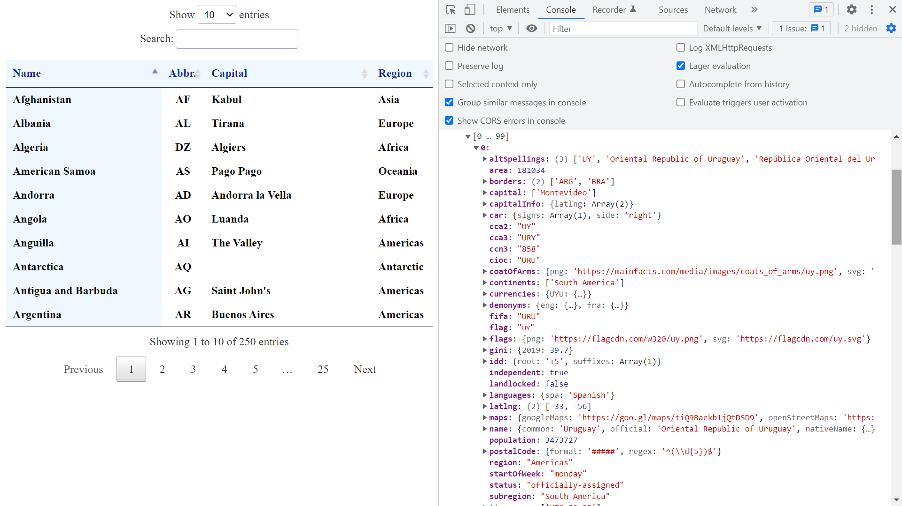

# :zap: Angular API DataTable

* Angular app using an Angular DataTables library to display API data in a responsive paginated HTML table with search box
* **Note:** to open web links in a new window use: _ctrl+click on link_


## :page_facing_up: Table of contents

* [:zap: Angular API DataTable](#zap-angular-api-datatable)
  * [:page\_facing\_up: Table of contents](#page_facing_up-table-of-contents)
  * [:books: General info](#books-general-info)
  * [:camera: Screenshots](#camera-screenshots)
  * [:signal\_strength: Technologies](#signal_strength-technologies)
  * [:floppy\_disk: Setup](#floppy_disk-setup)
  * [:computer: Code Examples](#computer-code-examples)
  * [:cool: Features](#cool-features)
  * [:clipboard: Status \& To-Do List](#clipboard-status--to-do-list)
  * [:clap: Inspiration](#clap-inspiration)
  * [:file\_folder: License](#file_folder-license)
  * [:envelope: Contact](#envelope-contact)

## :books: General info

* Angular DataTables library used for building complex HTML tables using DataTables
* [REST Countries API v3](https://restcountries.com/#api-endpoints-v3-all) endpoint used for country JSON data
* Not possible to use data Observable in HTML with `| async` because DataTables operates on JASON data so requires subscription to the data Observable.

## :camera: Screenshots



## :signal_strength: Technologies

* [Angular framework v16](https://angular.io/)
* [Angular DataTables library v16](https://l-lin.github.io/angular-datatables/#/welcome)
* [JQuery plug-in v3](https://www.npmjs.com/package/jquery)
* [ColReorder for DataTables v1](https://www.npmjs.com/package/datatables.net-colreorder) for responsive columns

## :floppy_disk: Setup

* Run `npm i` to install dependencies.
* Run `ng serve` for a dev server. Navigate to `http://localhost:4200/`. The app will automatically reload if you change any of the source files.
* Run `npm run build` to build the project. The build artifacts will be stored in the `dist/` directory. Use the `--prod` flag for a production build.

## :computer: Code Examples

* `app.component.ts` functions to fetch data via a separate service and destroy data table trigger

```typescript
  // get country list and subscribe, new table triggered with new data each RouterTestingModule
  getCountryList = (url: string): void => {
    this.countryService
      .fetchCountryList(url)
      .subscribe((data: CountryListInterface[]) => {
        this.countries = data;
        this.dtTrigger.next(data);
      });
  };

  // Table data unsubscribed in OnDestroy lifecycle
  ngOnDestroy(): void {
    this.dtTrigger.unsubscribe();
  }
```

## :cool: Features

* All table formatting, responsiveness, sorting etc. is taken care of - saves a lot of time

## :clipboard: Status & To-Do List

* Status: Working
* To-Do: Nothing

## :clap: Inspiration

* [Angular DataTables documentation](http://l-lin.github.io/angular-datatables/#/welcome)

## :file_folder: License

* This project is licensed under the terms of the MIT license.

## :envelope: Contact

* Repo created by [ABateman](https://github.com/AndrewJBateman), email: `gomezbateman@yahoo.com`
